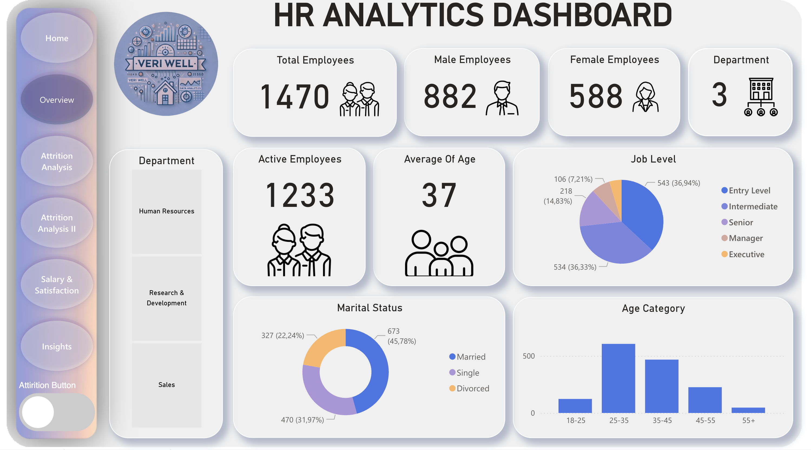
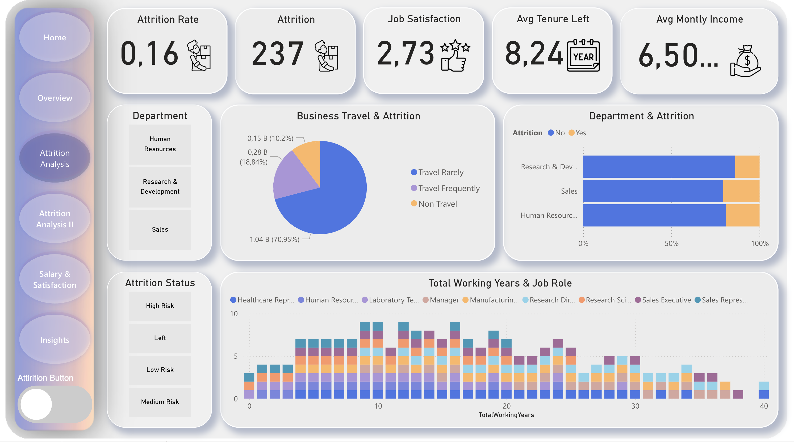
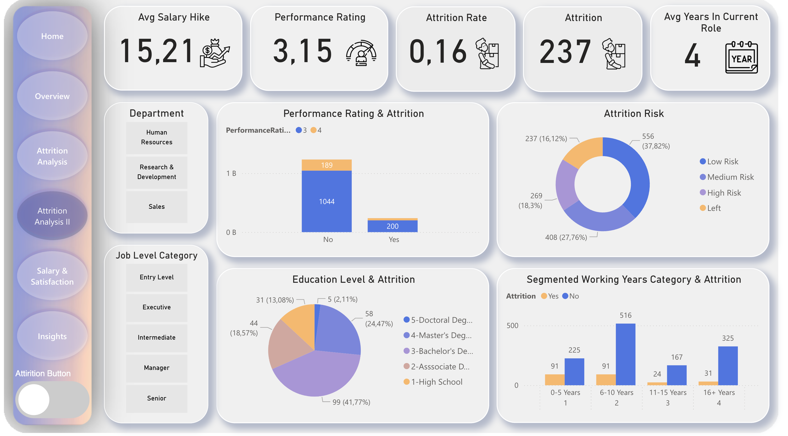
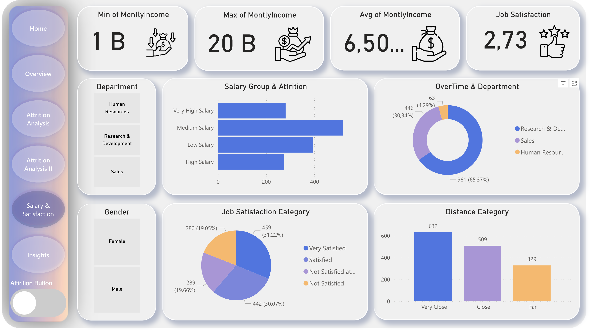
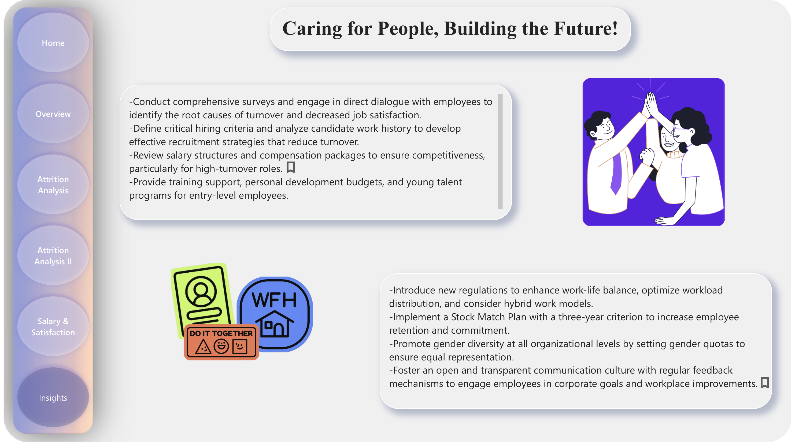

# HR Attrition Analysis & Prediction

This project analyzes employee attrition data to uncover key factors that influence voluntary employee turnover. Using Power BI, we built an interactive dashboard that showcases insights, trends, and predictive modeling outcomes based on HR data.

## 📌 Project Highlights

- **Problem**: Employee attrition affects team morale and organizational productivity. Understanding why employees leave helps mitigate future churn.
- **Objective**: Identify patterns in employee data to predict attrition risk.
- **Tools Used**: Power BI, DAX, and custom visuals (e.g., Sankey Diagram, Bar Chart Race)

## 🧱 Directory Structure

```
HR-Attrition-Analysis/
│
├── report/
│   └── Proje.pbix               # Power BI Dashboard with interactive visuals
│
├── images/                      # Screenshots or exported charts (optional)
│
└── README.md                    # Project description and documentation
```

## 🔍 Key Features in the Report

- **Attrition Breakdown**: Attrition by department, gender, age group, job role
- **Correlations**: Relationship between satisfaction, overtime, job level and attrition
- **Predictive Insights**: Data-driven assumptions about why employees may leave
- **Custom Visuals**: Enhanced storytelling with visuals like Sankey Diagram and Race Bar Chart

## 🚀 How to View the Report

To explore the interactive dashboard:

1. Download the file `Proje.pbix`
2. Open it with [Power BI Desktop](https://powerbi.microsoft.com/desktop)
3. Navigate through the report pages to explore the visuals

## 📂 Optional: How to Extend

If you have access to the raw dataset, you can:
- Modify the data model
- Apply new filters/measures
- Rebuild visuals for further analysis

## 📂 Screenshots

- 
- 
- 
- 
- 


---

If you found this project useful, consider giving it a ⭐ or sharing your thoughts.
